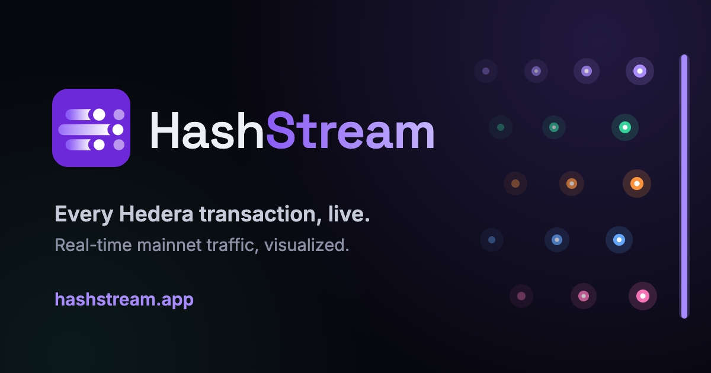

<p align="center">
  
</p>

<h1 align="center">HashStream</h1>

<p align="center">
  Live, real-time visualization of <a href="https://hedera.com">Hedera</a> mainnet traffic<br>
  <a href="https://hashstream.app"><strong>hashstream.app</strong></a>
</p>

A full-screen, real-time visualization of [Hedera](https://hedera.com) mainnet activity. Every transaction reaching consensus becomes a glowing dot flowing across the screen toward a "consensus bar," grouped into lanes by transaction type and sized by the fee paid.

## What it shows

- **Live transactions per second**, counted from the dots crossing the screen right now — the headline, the lane rates and the on-screen dot count always agree.
- **A consensus-time replay:** every transaction enters the river a fixed few seconds (~6–7s) after it reached consensus, so bursts and lulls keep their real rhythm. The delay adapts to the mirror node's publishing lag.
- **A "transaction river"** where every transaction is drawn as a dot — at any rate. Detailed records are fetched per-transaction; beyond the API's reach, dot counts are reconciled against block-header totals so the on-screen count always matches the real count.
- **Fixed type lanes** chosen at load time from a rate-weighted sample of the past 3 hours of traffic. Any type accounting for ≥1% of transactions gets its own lane (ordered by share); everything rarer is combined into a permanent "Other transactions" lane. Lanes never reorder or appear/disappear during a session.
- **Per-lane rate and share** of the dots on screen, plus **fee revenue** over a rolling 30-second window.
- **Hover any dot** to freeze it and inspect that exact transaction (ID, fee in ℏ and USD, memo, success/failure), with a link to view it on [HashScan](https://hashscan.io).
- **Fee revenue, daily pace, HBAR price, and a "while you've watched" tally** in the status bar, plus a per-block throughput sparkline.

All data comes live from the public Hedera mirror node — no backend, no build step, no API key.

## Views

- **Lanes** — the transaction river described above, one lane per transaction type.
- **Network** — a live map of *who is transacting with what*. Paying accounts are small stars; the topics (◯), contracts (⬡), tokens (◇) and accounts (●) they touch are larger bodies, sized by how busy they are and coloured by the transaction type they mostly receive. Every transaction flies from payer to destination along a curved link, a force layout clusters accounts around what they use (so bots, busy dApps and token hubs show up as structure), and each block sends a ripple out from the ℏ core. A side panel lists the busiest destinations by name — token names and topic/contract memos are looked up from the mirror node — and hovering anything shows what it is, its rate and its main counterparty, with a HashScan link.
- **Ambient** — a calm full-screen meteor shower for a second screen.

All three replay the same stream on the same clock, so the headline TPS always counts the dots currently in view.

## Usage

It's a single self-contained HTML file. Open it in a browser:

```sh
open index.html
```

Or serve it locally:

```sh
python3 -m http.server 8765
# then visit http://localhost:8765/
```

### Stress testing

Append `?stress=N` to inject `N` synthetic transactions/second on top of live traffic, to see how the visualization behaves under load:

```
/?stress=1500
```

Synthetic traffic is clearly labeled in the status line. Verified to hold 60 fps at 1,500 tx/s with ~4,500 concurrent dots.

## How it works

- **Data source:** [`mainnet-public.mirrornode.hedera.com`](https://mainnet-public.mirrornode.hedera.com/api/v1/docs/) — blocks and transactions polled every 1.5 seconds, the on-chain HBAR exchange rate every minute.
- **Rendering:** a single `<canvas>` with pre-rendered dot, comet-tail and flare sprites, additive blending, and a cheap two-level downsampled bloom pass; level-of-detail rendering shortens then drops tails as particle density rises to keep the frame rate steady.
- **Completeness:** block headers give exact transaction counts, so dots are never silently dropped — only the per-transaction detail (inspectable on hover) is capped.

## License

MIT
